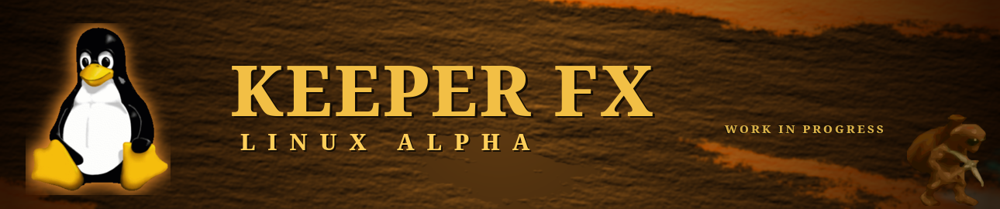

# KeeperFX Launcher — Linux-native fork



This is a **Linux-native fork** of the KeeperFX team's settings launcher
([dkfans/keeperfx-launcher-qt](https://github.com/dkfans/keeperfx-launcher-qt)), patched to drive the
**native Linux engine** (no Wine) and install the
[KeeperFX Linux Alpha](https://github.com/ForkedInTime/keeperfx-linux-alpha).

> ⚠️ **Unofficial — not affiliated with the KeeperFX team.** The launcher is *their* work; this fork only adds
> the Linux-native changes below. The official launcher (and the official game) live at
> [dkfans/keeperfx-launcher-qt](https://github.com/dkfans/keeperfx-launcher-qt) and
> [dkfans/keeperfx](https://github.com/dkfans/keeperfx).


---

## 🎮 Players: you don't need this repo

**Just want to play?** Don't build anything here. Grab the single self-contained **AppImage** from the alpha:

→ **[github.com/ForkedInTime/keeperfx-linux-alpha → Releases](https://github.com/ForkedInTime/keeperfx-linux-alpha/releases)**

Download one file, run it, and the only thing it ever asks for is your own *Dungeon Keeper* files. The
launcher (this project) is bundled inside it — engine, libraries, game data and all. No `apt install`, nothing
to set up. It works on any current 64-bit Linux distro (Ubuntu 24.04+/26.x, Fedora, Arch, Steam Deck).

---

## What this fork changes

The team's launcher compiles cross-platform, but it was written Windows-first — it launched the game through
**Wine** and read the version from a Windows `.exe`. This fork makes it drive the **native** engine:

- **`game.cpp`** — launch the native `keeperfx` ELF directly (no Wine) when present
- **`helper.h`** — detect the native binary (not just `keeperfx.exe`) as "installed"
- **`kfxversion.cpp`** — read the engine version from `version.txt` (a native ELF has no PE resources)
- **`apiclient.cpp`** — install the complete Linux package from the alpha's GitHub release
- **`CMakeLists.txt`** — the `-static` link flag is Windows-only (Linux links Qt dynamically)

A GitHub Actions workflow ([`build-appimage.yml`](.github/workflows/build-appimage.yml)) builds the whole
self-contained AppImage on Ubuntu 24.04 — bundling Qt **and** the engine + its libraries + the free game data.

## 🛠️ Advanced: build from source

You need a C++17 toolchain, CMake, Ninja, and **Qt 6.7+** (the launcher uses `QNetworkRequestFactory`).
Ubuntu 24.04 ships Qt 6.4, so install a newer Qt (e.g. via [aqtinstall](https://github.com/miurahr/aqtinstall))
— the CI workflow shows the exact steps. CPM fetches zlib/bit7z/LIEF automatically.

```bash
cmake -S . -B build -G Ninja -DCMAKE_BUILD_TYPE=Release
cmake --build build -j"$(nproc)"
```

This produces `build/keeperfx-launcher-qt`. The launcher expects to live in the game's install directory
(it reads/writes config and finds the engine there); the AppImage's `AppRun` handles that by running it from a
writable install dir.

## Credits & License

The launcher is the work of the **KeeperFX team and the Keeper Klan community**
([dkfans/keeperfx-launcher-qt](https://github.com/dkfans/keeperfx-launcher-qt)), based on
[ImpLauncher](https://keeperfx.net/workshop/item/410/implauncher-beta). This fork only adds the Linux-native
patches above.

GNU General Public License v2.0 — same as upstream.
