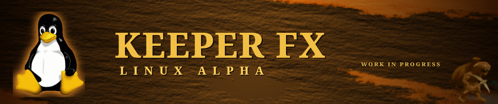

# KeeperFX Launcher — Tux Edition



This is a **Linux-native fork** of the KeeperFX team's settings launcher
([dkfans/keeperfx-launcher-qt](https://github.com/dkfans/keeperfx-launcher-qt)), patched to drive the
**native Linux engine** (no Wine) and to install and update
[KeeperFX Tux Edition](https://github.com/ForkedInTime/keeperfx-linux-alpha).


Browse and install the whole [keeperfx.net](https://keeperfx.net) workshop without leaving the launcher, manage
your mods, install the Unearth map editor, and update the game in place — all on native Linux.

> ⚠️ **Unofficial — not affiliated with the KeeperFX team.** The launcher is *their* work; this fork only adds
> the Linux-native changes below. The official launcher (and the official game) live at
> [dkfans/keeperfx-launcher-qt](https://github.com/dkfans/keeperfx-launcher-qt) and
> [dkfans/keeperfx](https://github.com/dkfans/keeperfx).

---

## 🎮 Players: you don't need this repo

**Just want to play?** Don't build anything here. Grab the single self-contained **AppImage** from the game repo:

→ **[github.com/ForkedInTime/keeperfx-linux-alpha → Releases](https://github.com/ForkedInTime/keeperfx-linux-alpha/releases)**

Download one file, run it, and the only thing it ever asks for is your own *Dungeon Keeper* files. The
launcher (this project) is bundled inside it — engine, libraries, game data and all. No `apt install`, nothing
to set up. It works on any current 64-bit Linux distro (Ubuntu 24.04+/26.x, Fedora, Arch, Steam Deck).

A **Flatpak** and Arch **AUR** packages are also published from the game repo — see its README for those.

---

## What this fork changes

### Native-Linux plumbing

The team's launcher compiles cross-platform, but it was written Windows-first — it launched the game through
**Wine** and read the version from a Windows `.exe`. This fork makes it drive the **native** engine:

- **`game.cpp`** — launch the native `keeperfx` ELF directly (no Wine) when present
- **`helper.h`** — detect the native binary (not just `keeperfx.exe`) as "installed", and open external links
  in a way that survives the AppImage's sandboxed environment
- **`kfxversion.cpp`** — read the engine version from `version.txt` (a native ELF has no PE resources)
- **`apiclient.cpp`** — install and self-update from this fork's GitHub releases, and show this fork's release
  notes in the news panel (the stock panel only knows about the Windows project)
- **`CMakeLists.txt`** — the `-static` link flag is Windows-only (Linux links Qt dynamically)

### Features added on top

The fork has grown well past the porting patches. Everything below is ours, not upstream's:

- **Workshop browser** (`workshopbrowserdialog.cpp`) — browse the full [keeperfx.net](https://keeperfx.net)
  catalogue in-launcher with thumbnails, categories, search and ratings; install with one click. Thumbnails
  and the catalogue are cached on disk (stale-while-revalidate), and downloads fall back to the website when
  the API publishes no file.
- **Installed manager** — a second tab listing what you actually have across `campgns/`, `levels/`,
  `personal/` and `mods/`, distinguishing stock content from your own, with a reversible **Uninstall →
  Restore** backed by a recycle bin.
- **Mod Manager** (`modmanager*.cpp`) — list mods, enable/disable them, persist `mods/load_order.cfg`.
- **Universal installer** (`addoninstaller.cpp`) — one code path that installs mods, campaigns, map packs and
  loose maps from a `.7z`/`.zip`, coping with the several archive layouts the workshop actually ships.
- **Map Editor** (`downloadmapeditordialog.cpp`) — install and launch **Unearth** from the launcher, and get
  offered an update when a newer Unearth appears.
- **Log viewer** (`logviewerdialog.cpp`) — read the engine and launcher logs without hunting for the files.
- **Music recovery** — detect an installation whose `music/` folder is empty, partial or non-standard and
  offer the download, instead of silently playing nothing.
- **Update check** — compare the installed engine against this fork's latest release and update in place.
- **Single-instance lock** (`main.cpp`) — one launcher at a time; `--allow-multiple` overrides it.
- **UI scale** — a Comfortable (110%) step between Normal and Large.

### Tests

`tests/run.sh` builds and runs the standalone logic tests (version parsing, archive-shape detection, tree
copying, workshop URL handling) straight from source — no launcher build required. It exits non-zero on
failure.

### CI

The release AppImage and Flatpak are built by **`build-appimage.yml` and `build-flatpak.yml` in the
[game repo](https://github.com/ForkedInTime/keeperfx-linux-alpha)**, which clone this repo's **`alpha`**
branch. They live there because a workflow can only be triggered by, and attach assets to, a release in its
own repository. This repo keeps a manual-dispatch copy of
[`build-appimage.yml`](.github/workflows/build-appimage.yml) for launcher-side debugging: it builds a working
AppImage from the current branch without touching any release.

Push launcher work to **both `alpha` and `master`** — `alpha` is what the release build clones.

## 🛠️ Advanced: build from source

You need a C++17 toolchain, CMake 3.24+, Ninja, and **Qt 6.7+** (the launcher uses
`QNetworkRequestFactory`). Ubuntu 24.04 ships Qt 6.4, so install a newer Qt (e.g. via
[aqtinstall](https://github.com/miurahr/aqtinstall)) — the CI workflow shows the exact steps, and pins
**6.8.3**. CPM fetches zlib/bit7z/LIEF automatically.

```bash
cmake -S . -B build -G Ninja -DCMAKE_BUILD_TYPE=Release
cmake --build build -j"$(nproc)"
```

This produces `build/keeperfx-launcher-qt`. The launcher expects to live in the game's install directory
(it reads/writes config and finds the engine there); the AppImage's `AppRun` handles that by running it from a
writable install dir.

> ⚠️ **Do not drop a locally built binary into an AppImage install.** The AppImage bundles Qt 6.8.3, so a
> binary built against a newer distro Qt dies with `libQt6Core.so.6: version 'Qt_6.x' not found`. Run your
> local build directly against your system Qt instead, and let CI produce the binary that ships.

## Credits & License

The launcher is the work of the **KeeperFX team and the Keeper Klan community**
([dkfans/keeperfx-launcher-qt](https://github.com/dkfans/keeperfx-launcher-qt)), based on
[ImpLauncher](https://keeperfx.net/workshop/item/410/implauncher-beta). This fork adds the Linux-native
patches and the features above.

GNU General Public License v2.0 — same as upstream.
